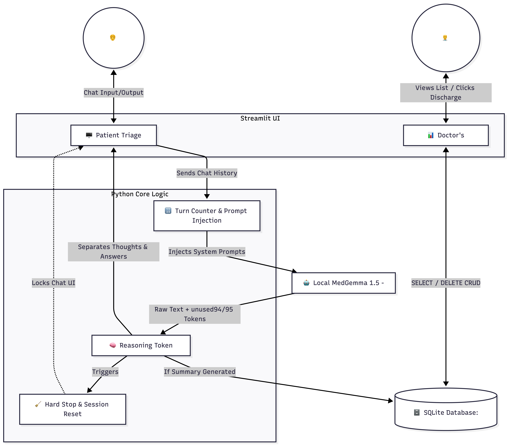

# 🩺 MedGemma Clinical Triage System & Physician Dashboard

[](https://www.python.org/)
[](https://streamlit.io/)
[](https://huggingface.co/google/medgemma-1.5-4b-it)

> 👉 **[Click here to try the Live Web Demo on Hugging Face Spaces]** *([(https://huggingface.co/spaces/TejaswiniRay/Clinical-Triage-Demo)])*
> 
> 👉 **[Read the full technical article about this project]** *(https://medium.com/@tej.ray448/building-a-clinical-triage-ai-with-googles-medgemma-1-5-2ab1a49d03b2)*

## 📌 Project Overview
Healthcare systems face massive administrative bottlenecks, with doctors spending hours reading intake forms. This project is an end-to-end, privacy-first AI Triage System built using Google's **MedGemma 1.5 (4B)** open-weight model. 

It acts as a virtual clinic assistant that securely interviews patients, extracts medical symptoms using Chain-of-Thought reasoning, and populates a backend SQLite physician dashboard—all designed to run locally on-premise to simulate strict data privacy environments.

## 🔬 Implementing the MedGemma Technical Report
This project serves as an applied implementation of several core capabilities highlighted by Google DeepMind and Google Research in the MedGemma Technical Report:
*   **Medical Agentic Behavior:** Implements the paper's claims on patient interviewing and triaging by allowing the model to autonomously guide a multi-turn symptom gathering process.
*   **Clinical Reasoning Extraction:** Validates the model's advanced clinical reasoning by intercepting, parsing, and displaying the hidden `<unused94>` Chain-of-Thought tokens in the UI.
*   **Strict Constraint Compliance:** Tests the model's instruction-tuning by enforcing negative prompt constraints ("Do not diagnose") and rigid output formatting.
*   **Privacy-Preserving Edge AI:** Proves the paper's thesis that the compact 4B architecture can perform complex medical NLP tasks entirely locally, eliminating the need for cloud-based PHI (Protected Health Information) transmission.
### 🏗️ System Architecture



## ✨ Key Technical Features (The Engineering)
*   **Advanced Reasoning Parsing:** MedGemma 1.5 uses hidden reasoning tokens. The app intercepts the AI's internal Chain-of-Thought *before* it renders to the UI, parses the strings, and hides the logic inside a collapsible "Reasoning Trace" expander for physician oversight.
*   **Strict Jinja Template Compliance:** The Gemma family strictly requires alternating `user`/`assistant` chat structures. The app uses prompt engineering injection to dynamically combine system prompts and hidden directives into standard user turns to prevent pipeline crashes.
*   **Programmatic "Hard Stop":** To prevent infinite chat loops, Python logic counts user turns. On the 5th turn, a secret system directive is appended to force the AI to output a 3-bullet **CLINICAL SUMMARY**, automatically disabling the chat interface.
*   **Full CRUD Architecture:** The front-end is backed by a local **SQLite** database (`clinic.db`). Completed patient summaries are instantly saved and routed to a secondary "Doctor's Dashboard" view.
*   **Data Compliance Workflows:** To simulate HIPAA/GDPR data-retention requirements, the dashboard features a **Discharge Patient** action that executes a SQL `DELETE` command, permanently and securely wiping the temporary patient record.

## 🛠️ Tech Stack
*   **AI Model:** Google DeepMind's `medgemma-1.5-4b-it`
*   **LLM Pipeline:** `transformers`, `torch`, `accelerate`
*   **Frontend Framework:** Streamlit
*   **Database Backend:** SQLite (`sqlite3`)

## 🚀 Installation & Setup (Local)

**1. Clone the repository:**
```bash
git clone https://github.com/YOUR_USERNAME/MedGemma-Triage-System.git
cd MedGemma-Triage-System
```

**2. Install dependencies:**
```bash
pip install -r requirements.txt
```

**3. Get Hugging Face Access:**
*   Create a Hugging Face account.
*   Go to [google/medgemma-1.5-4b-it](https://huggingface.co/google/medgemma-1.5-4b-it) and agree to the *Health AI Developer Foundations* terms.
*   Generate an Access Token in your Hugging Face settings.

**4. Add your Token:**
*   Create a folder named `.streamlit` in the project root.
*   Inside it, create a file named `secrets.toml` and add:
    ```toml
    HF_TOKEN = "your_actual_token_here"
    ```

**5. Run the Application:**
```bash
streamlit run app.py
```

## 🏥 How to Use It
1. **Patient View:** Start on the "Patient Triage" screen. Describe a medical symptom. Answer the AI's follow-up questions.
2. **AI Reasoning:** Click "🧠 View AI Reasoning Trace" on the AI's replies to see its internal medical logic.
3. **Completion:** On the 5th interaction, the AI will lock the chat and generate the summary. Click "Start Triage for Next Patient" to reset the kiosk.
4. **Physician View:** Use the sidebar to navigate to the "Doctor's Dashboard". Read the generated patient summaries.
5. **Discharge:** Click "✅ Discharge" to permanently wipe the record from the SQLite database.

## 🔮 Future Roadmap
- [ ] Migrate SQLite backend to a cloud-based PostgreSQL database.
- [ ] Format the summary output into **FHIR (Fast Healthcare Interoperability Resources)** JSON standards for direct EHR integration (e.g., Epic, Cerner).
- [ ] Add MedASR (Speech-to-Text) so patients can speak into the kiosk instead of typing.

---
*Disclaimer: This application is for educational, portfolio, and demonstration purposes only. It is not intended for real-world medical diagnosis or actual patient use.*
